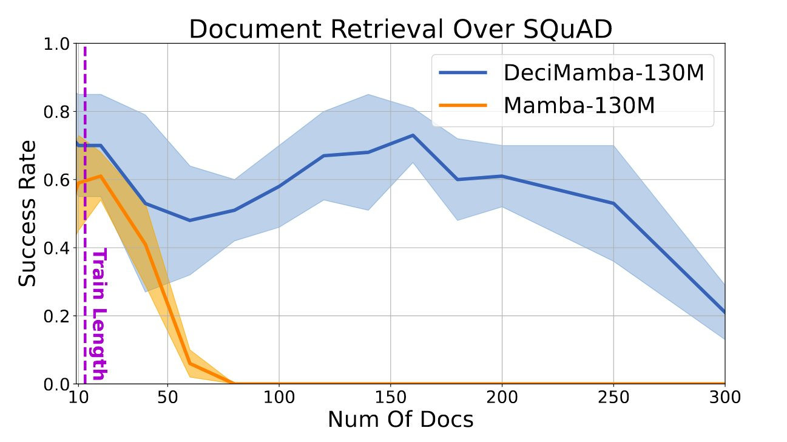
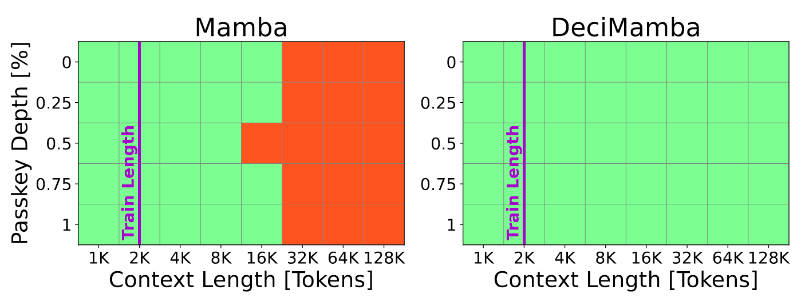

# DeciMamba: Exploring the Length Extrapolation Potential of Mamba

<p align="center">

<a href="https://assafbk.github.io/website/">Assaf Ben-Kish</a>,
<a href="https://itamarzimm.github.io/">Itamar Zimerman</a>,
<a href="https://scholar.google.com/citations?user=FZYAWe4AAAAJ&hl=en">Shady Abu-Hussein</a>,
<a href="https://scholar.google.co.il/citations?user=DmzoCRMAAAAJ&hl=en">Nadav Cohen</a>,
<a href="https://scholar.google.com/citations?user=5JserkUAAAAJ&hl=en">Amir Globerson</a>,
<a href="https://scholar.google.co.il/citations?user=UbFrXTsAAAAJ&hl=en">Lior Wolf</a>,
<a href="https://www.giryes.sites.tau.ac.il/">Raja Giryes</a>

<a href="https://arxiv.org/abs/2406.14528"></a>

We present DeciMamba (Decimating-Mamba), the first context extension method for Mamba. 
In synthetic tasks, as well as in real-world long-range NLP tasks, DeciMamba is able to extrapolate to sequences that are magnitudes longer than the ones seen during training. It does so while requiring less computational resources and doesn't require retraining:

   <br>
  


</p>
<br>

# Release Updates
* [23/7/2024] Added a notebook for Mamba hidden attention calculation
* [11/7/2024] Code published!

<br>

# Setup
## Clone Project
```
git clone https://github.com/assafbk/DeciMamba.git
cd DeciMamba
```

## Create Environment
To set up our environment, please run:
```
conda env create -f environment.yml
conda activate decimamba
```

Install Mamba:
```
pip install causal-conv1d==1.1.1
pip install mamba-ssm==1.1.1
```

## Additional Requirements - Passkey Retrieval

Install the required submodule via:
```
git submodule init
git submodule update
```

## Additional Requirements -  Language Modeling
In order to train/evaluate the Language Modeling task, the PG-19 dataset must be tokenized. This can be done using the following script:
```
python ./custom_datasets/tokenize_pg19.py
```
* if only evaluation is desired, add the ```--eval_only``` flag (training set tokenization is significantly longer than the others).
* The default save location is ```./artifacts/ppl_test/pg19```. If a different location is desired, make sure to change the relevant paths in ```./custom_datasets/pg19.py``` and ```./custom_datasets/tokenize_pg19.py```

<br>

# Evaluate DeciMamba
We uploaded the weights of the best DeciMamba and Mamba models for each task:
|Eval ID|Task| Model type | Checkpoint | 
|----------|----------|----------|------------|
|0|Document Retrieval|DeciMamba-130m|[🤗 assafbk/decimamba-130m-squad-doc-ret](https://huggingface.co/assafbk/decimamba-130m-squad-doc-ret)|
|1|Document Retrieval|Mamba-130m|[🤗 assafbk/mamba-130m-squad-doc-ret](https://huggingface.co/assafbk/mamba-130m-squad-doc-ret)|
|2|Passkey Retrieval|DeciMamba-130m|[🤗 assafbk/decimamba-130m-niah](https://huggingface.co/assafbk/decimamba-130m-niah)|
|3|Passkey Retrieval|Mamba-130m|[🤗 assafbk/mamba-130m-niah](https://huggingface.co/assafbk/mamba-130m-niah)|
|4|Language Modeling|DeciMamba-130m|[🤗 assafbk/decimamba-130m-pg19](https://huggingface.co/assafbk/decimamba-130m-pg19)|
|5|Language Modeling|Mamba-130m|[🤗 assafbk/mamba-130m-pg19](https://huggingface.co/assafbk/mamba-130m-pg19)|
|6|Passkey Retrieval - Save Data For Mamba Attn Maps|Mamba-130m|[🤗 assafbk/mamba-130m-niah](https://huggingface.co/assafbk/mamba-130m-niah)|

<br>

To run the evaluation script:
```
python finetune_ssm.py --eval <eval_id> --device <device_id>
```
Arguments:
* \<eval_id> - int, from the list above<br>
* \<device_id> - int, cuda device id

<br>

# Train DeciMamba

To run the training script:
```
python finetune_ssm.py
```
All training metrics are displayed in the wandb webpage.

The configuration file is ```./configs/finetune_ssm_config.json```. <br>
General configurations:
* ```mamba_arch```: "deci" / "vanilla"
* ```model_device```: "cuda:x" # x is the device id (e.g. 2)

Decimation configurations:
* ```activate_decimation```: Initialized to true
* ```decimation_beta```: Initialized to 0.5
* ```decimating_layers```: Initialized to [12]
* ```decimation_min_seq_len```: Minimal sequence length allowed after a decimation block. Initialized to 20.
* ```decimation_max_p_L_base```: Lbase. Initialized to 2000.

Note that decimation is automatically disabled when mamba_arch != "deci". 

Additional configurations:
* ```output_dir```: Where to save model checkpoints. Initialized to <project_dir>/output.
* ```cache_dir```: Huggingface cache dir for all models. Initialized to <project_dir>/hf_cache.
* ```activate_logging```: Enables wandb logging. Initialized to True.
* ```save_steps```: Model saving interval. Initialized to 200 (Note: best model is always saved regardless of this value).
* ```eval_steps```: Model evaluation interval. Initialized to 10.
* ```max_step```: Maximal amount of training steps. Initialized to 20000.

Check out ```./configs/finetune_ssm_config.json``` for more configurations.


## Train for Document Retrieval
In ```./configs/finetune_ssm_config.json``` set:
* ```dataset```: "squad_retrieve"

Special configurations:
* ```multidoc_num_noise_docs_train```: Amount of documents to use in a training sample. Initialized to 11.
* ```multidoc_num_noise_docs_eval```: Amounts of documents to use during evaluation (all are evaluated in a single evaluation step). Initialized to [10, 20, 40, 80, 120, 160, 200].

## Train for Passkey Retrieval
First, make sure that the additional submodule was cloned (see 'Additional Requirements - Passkey Retrieval' above).

Then, in ```./configs/finetune_ssm_config.json``` set:
* ```dataset```: "niah_custom"

Special configurations:
* ```niah_train_set_size```: Initialized to 6144.
* ```niah_context_len_train```: Context length used during training. Initialized to 2000.
* ```niah_needle_depths_eval```: Needle depths used during evaluation. Initialized to [0, 0.25, 0.5, 0.75, 1].
* ```niah_context_lens_eval```: Context lengths used during evaluation. Initialized to [1000, 2000, 4000, 8000, 16000, 32000, 64000, 128000].

## Train for Language Modeling
First, make sure that the PG-19 dataset was tokenized (see 'Additional Requirements - Language Modeling' above).

Next, in ```./configs/finetune_ssm_config.json``` set:
* ```dataset```: "ppl_test"

Special configurations:
* ```ppl_test_context_len_train```: Context length used during training. Initialized to 2000.
* ```ppl_test_context_lens_eval```: Context lengths used during evaluation. Initialized to [1000, 2000, 4000, 10000, 20000, 30000, 40000, 50000, 60000].
* ```ppl_test_num_windows_per_context_len_eval```: Amount of context windows evaluated per sample during evaluation. Initialized to 10.
* ```ppl_test_pred_len```: Amount of samples to evaluate per context length. Initialized to 100.


## Notes and Tips:
* DeciMamba does not currently support batched inference, therefore the batch size is set according to ```grad_accum_steps```.
<br>

* We provide a simple automatic algorithm to find the first decimating layer, which doesnt require computing hidden attention. To use it, simply set ```find_deci_layer``` to true. <br>
Short explanation: similar to table 10 in the paper, we scan the first decimating layer, and select the one with the best perfomrance. The model should perform quite well when using only this layer as a DeciMamba layer.

<br>


# Calculate Mamba Hidden Attention Maps
To calculate Mamba's hidden attention maps:
* Record data for matrices by running:
```
python finetune_ssm.py --eval 6 --device <device_id>
```
* open ```calculate_mamba_attn_maps.ipynb``` and run notebook.

<br>

# Acknowledgments
We thank the authors of Mamba for their amazing work and contribution: https://github.com/state-spaces/mamba

Additionally, we thank the authors of BABILong, as we use a version of their code for the passkey retrieval task: https://github.com/booydar/babilong

# Citation
If you find this work useful, please cite the following:
```bibtex
@misc{benkish2024decimambaexploringlengthextrapolation,
      title={DeciMamba: Exploring the Length Extrapolation Potential of Mamba}, 
      author={Assaf Ben-Kish and Itamar Zimerman and Shady Abu-Hussein and Nadav Cohen and Amir Globerson and Lior Wolf and Raja Giryes},
      year={2024},
      eprint={2406.14528},
      archivePrefix={arXiv},
      primaryClass={cs.LG},
      url={https://arxiv.org/abs/2406.14528}, 
}
```
